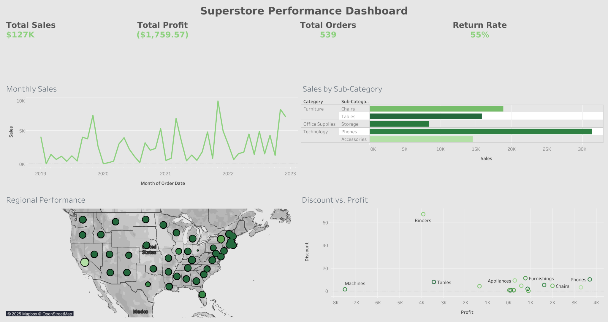

# 📊 Superstore Performance Dashboard



## 📌 Overview
This project uses **Python**, **Excel**, and **Tableau** to analyze sales, profit, and returns from the Superstore dataset.  
The goal is to find business insights, identify profit-driving categories, and visualize trends.

## 📊 Dashboard
🔗 **[View Live Tableau Dashboard](https://public.tableau.com/app/profile/aasim.mansuri/viz/SuperstorePerformanceDashboard_17545493913350/Dashboard1?publish=yes)**

## 📂 Files in this Project
- `Global_E_Commerce_Sales_and_Customer_Behavior_Dashboard.ipynb` → Python code for data cleaning & EDA  
- `Cleaned_Superstore_Return_Analysis.xls` → Cleaned dataset  
- `images/superstore_performance_dashboard.png` → Tableau dashboard screenshot  
- `README.md` → Project documentation  
- `requirements.txt` → Python dependencies  

## 🛠 Tools Used
- **Python** → Pandas, NumPy, Matplotlib, Seaborn  
- **Excel** → Initial dataset  
- **Tableau Public** → Dashboard creation  
- **Jupyter Notebook** → Data exploration & cleaning  

## 📈 Steps I Did
1. Collected and reviewed the Superstore dataset.  
2. Cleaned and transformed data using Python (handled missing values, standardization).  
3. Conducted Exploratory Data Analysis (EDA) to identify sales & profit patterns.  
4. Designed an interactive Tableau dashboard with KPIs, filters, and category insights.  

## 💡 Key Insights
- **Total Sales:** $127K  
- **Total Profit:** $1.76K  
- **Return Rate:** 55%  
- Technology (especially Phones) generates the highest sales.  
- Furniture (Tables & Machines) shows losses due to heavy discounting.  

## 🚀 How to Run This Project
1. Download the files from this repository.  
2. Install dependencies:
```bash
pip install pandas numpy matplotlib seaborn openpyxl
```
3. Open the Jupyter notebook:
```bash
jupyter notebook notebooks/Global_E_Commerce_Sales_and_Customer_Behavior_Dashboard.ipynb
```

---
👤 **Author:** [Aasim Mansuri](https://www.linkedin.com/in/aasim-mansuri-56a944203)  
🔗 [LinkedIn Profile](https://www.linkedin.com/in/aasim-mansuri-56a944203)  
🔗 [Tableau Public Profile](https://public.tableau.com/app/profile/aasim.mansuri)
